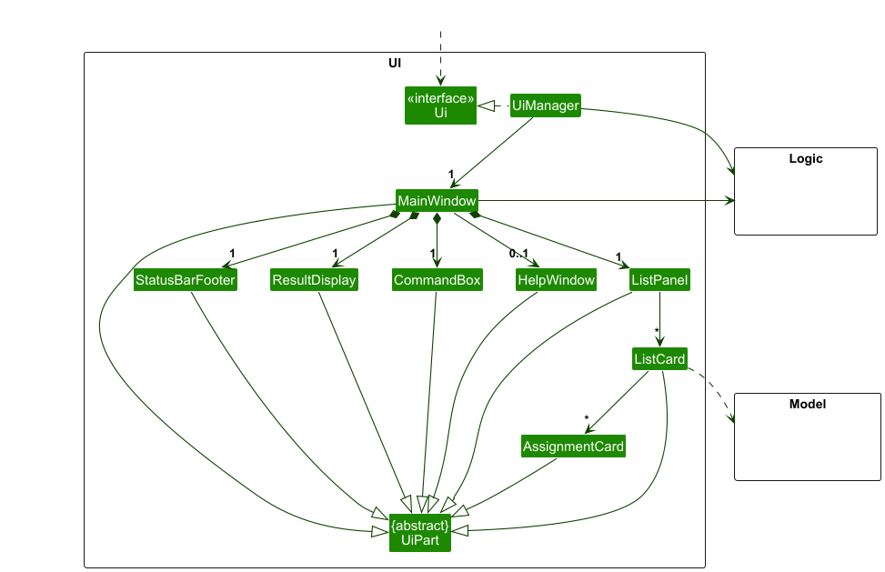
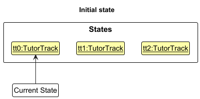
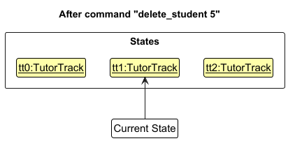
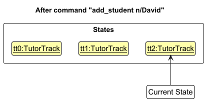
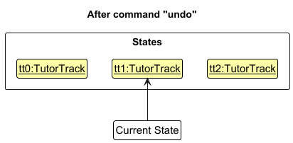
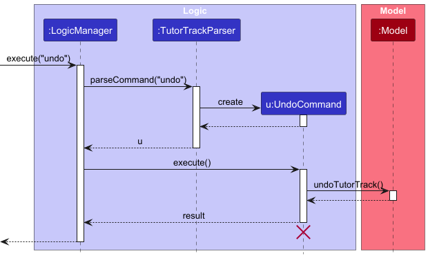
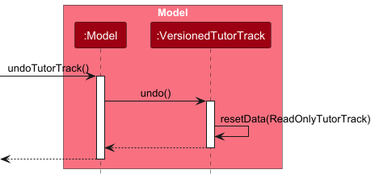
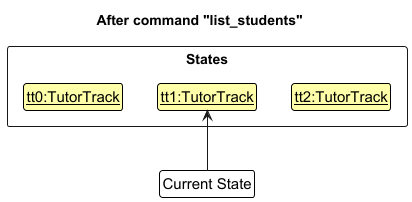
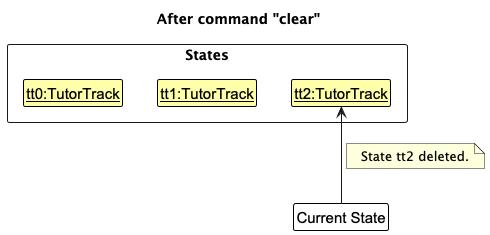

* Table of Contents
{:toc}

--------------------------------------------------------------------------------------------------------------------

## **Acknowledgements**

- JavaFX Tutorial adapted from [Oracle JavaFX documentation](https://openjfx.io/)
- PlantUML diagrams adapted from [se-edu PlantUML Guide](https://se-education.org/guides/tutorials/plantUml.html)
- Command parsing approach adapted from [AddressBook-Level3](https://github.com/se-edu/addressbook-level3)

--------------------------------------------------------------------------------------------------------------------

## **Setting up, getting started**

Refer to the [_Setting up and Getting Started Guide_](SettingUp.md).

--------------------------------------------------------------------------------------------------------------------

## **Design**

:bulb: **Tip:** The `.puml` files used to create diagrams in this document `docs/diagrams` folder. Refer to the [_PlantUML Tutorial_ at se-edu/guides](https://se-education.org/guides/tutorials/plantUml.html) to learn how to create and edit diagrams.

### Architecture

The ***Architecture Diagram*** given above explains the high-level design of the App.

Given below is a quick overview of main components and how they interact with each other.

**Main components of the architecture**

**`Main`** (consisting of classes [`Main`](https://github.com/se-edu/addressbook-level3/tree/master/src/main/java/seedu/address/Main.java) and [`MainApp`](https://github.com/se-edu/addressbook-level3/tree/master/src/main/java/seedu/address/MainApp.java)) is in charge of the app launch and shut down.
* At app launch, it initializes the other components in the correct sequence, and connects them up with each other.
* At shut down, it shuts down the other components and invokes cleanup methods where necessary.

The bulk of the app's work is done by the following four components:

* [**`UI`**](#ui-component): The UI of the App.
* [**`Logic`**](#logic-component): The command executor.
* [**`Model`**](#model-component): Holds the data of the App in memory.
* [**`Storage`**](#storage-component): Reads data from, and writes data to, the hard disk.

[**`Commons`**](#common-classes) represents a collection of classes used by multiple other components.

**How the architecture components interact with each other**

The *Sequence Diagram* below shows how the components interact with each other for the scenario where the user issues the command `delete_student 1`.

Each of the four main components (also shown in the diagram above),

* defines its *API* in an `interface` with the same name as the Component.
* implements its functionality using a concrete `{Component Name}Manager` class (which follows the corresponding API `interface` mentioned in the previous point.

For example, the `Logic` component defines its API in the `Logic.java` interface and implements its functionality using the `LogicManager.java` class which follows the `Logic` interface. Other components interact with a given component through its interface rather than the concrete class (reason: to prevent outside component's being coupled to the implementation of a component), as illustrated in the (partial) class diagram below.

The sections below give more details of each component.

### UI component

The **API** of this component is specified in [`Ui.java`](https://github.com/se-edu/addressbook-level3/tree/master/src/main/java/seedu/address/ui/Ui.java)

The UI consists of a `MainWindow` that is made up of parts e.g.`CommandBox`, `ResultDisplay`, `ListPanel`, `StatusBarFooter` etc. All these, including the `MainWindow`, inherit from the abstract `UiPart` class which captures the commonalities between classes that represent parts of the visible GUI.

The `UI` component uses the JavaFx UI framework. The layout of these UI parts are defined in matching `.fxml` files that are in the `src/main/resources/view` folder. For example, the layout of the [`MainWindow`](https://github.com/se-edu/addressbook-level3/tree/master/src/main/java/seedu/address/ui/MainWindow.java) is specified in [`MainWindow.fxml`](https://github.com/se-edu/addressbook-level3/tree/master/src/main/resources/view/MainWindow.fxml)

The `UI` component,

* executes user commands using the `Logic` component.
* listens for changes to `Model` data so that the UI can be updated with the modified data.
* keeps a reference to the `Logic` component, because the `UI` relies on the `Logic` to execute commands.
* depends on some classes in the `Model` component, as it displays `Student` object and `Lesson` object residing in the `Model`.

### Logic component

**API** : [`Logic.java`](https://github.com/se-edu/addressbook-level3/tree/master/src/main/java/seedu/address/logic/Logic.java)

Here's a (partial) class diagram of the `Logic` component:

The sequence diagram below illustrates the interactions within the `Logic` component, taking `execute("delete_student 1")` API call as an example.

:information_source: **Note:** The lifeline for `DeleteStudentCommandParser` should end at the destroy marker (X) but due to a limitation of PlantUML, the lifeline continues till the end of diagram.

How the `Logic` component works:

1. When `Logic` is called upon to execute a command, it is passed to an `AddressBookParser` object which in turn creates a parser that matches the command (e.g., `DeleteStudentCommandParser`) and uses it to parse the command.
1. This results in a `Command` object (more precisely, an object of one of its subclasses e.g., `DeleteStudentCommandParser`) which is executed by the `LogicManager`.
1. The command can communicate with the `Model` when it is executed (e.g. to delete a student). 
   Note that although this is shown as a single step in the diagram above (for simplicity), in the code it can take several interactions (between the command object and the `Model`) to achieve.
1. The result of the command execution is encapsulated as a `CommandResult` object which is returned back from `Logic`.

Here are the other classes in `Logic` (omitted from the class diagram above) that are used for parsing a user command:

How the parsing works:
* When called upon to parse a user command, the `AddressBookParser` class creates an `XYZCommandParser` (`XYZ` is a placeholder for the specific command name e.g., `AddStudentCommandParser`) which uses the other classes shown above to parse the user command and create a `XYZCommand` object (e.g., `AddStudentCommand`) which the `AddressBookParser` returns back as a `Command` object.
* All `XYZCommandParser` classes (e.g., `AddStudentCommandParser`, `DeleteStudentCommandParser`, ...) inherit from the `Parser` interface so that they can be treated similarly where possible e.g, during testing.

### Model component
**API** : [`Model.java`](https://github.com/se-edu/addressbook-level3/tree/master/src/main/java/seedu/address/model/Model.java)

The `Model` component,

* stores the address book data i.e., all `Student` objects (which are contained in a `UniqueStudentList` object).
* stores the currently 'selected' `Student` objects (e.g., results of a search query) as a separate _filtered_ list which is exposed to outsiders as an unmodifiable `ObservableList<Student>` that can be 'observed' e.g. the UI can be bound to this list so that the UI automatically updates when the data in the list change.
* stores a `UserPref` object that represents the user’s preferences. This is exposed to the outside as a `ReadOnlyUserPref` objects.
* does not depend on any of the other three components (as the `Model` represents data entities of the domain, they should make sense on their own without depending on other components)

:information_source: **Note:** An alternative (arguably, a more OOP) model is given below. It has a `Name` list in the `AddressBook`, which `Student` and `Lesson` references. This allows `AddressBook` to only require one `Name` object per unique name, instead of each `Student` and `Lesson` needing their own `Name` objects. 

### Storage component

**API** : [`Storage.java`](https://github.com/se-edu/addressbook-level3/tree/master/src/main/java/seedu/address/storage/Storage.java)

The `Storage` component,
* can save both address book data and user preference data in JSON format, and read them back into corresponding objects.
* inherits from both `AddressBookStorage` and `UserPrefStorage`, which means it can be treated as either one (if only the functionality of only one is needed).
* depends on some classes in the `Model` component (because the `Storage` component's job is to save/retrieve objects that belong to the `Model`)

### Common classes

Classes used by multiple components are in the `seedu.address.commons` package.

--------------------------------------------------------------------------------------------------------------------

## **Implementation**

This section describes some noteworthy details on how certain features are implemented.

### \[Proposed\] Undo/redo feature

#### Proposed Implementation

The proposed undo/redo mechanism is facilitated by `VersionedAddressBook`. It extends `AddressBook` with an undo/redo history, stored internally as an `addressBookStateList` and `currentStatePointer`. Additionally, it implements the following operations:

* `VersionedAddressBook#commit()` — Saves the current AddressBook state in its history.
* `VersionedAddressBook#undo()` — Restores the previous AddressBook state from its history.
* `VersionedAddressBook#redo()` — Restores a previously undone AddressBook state from its history.

These operations are exposed in the `Model` interface as `Model#commitAddressBook()`, `Model#undoAddressBook()` and `Model#redoAddressBook()` respectively.

Given below is an example usage scenario and how the undo/redo mechanism behaves at each step.

Step 1. The user launches the application for the first time. The `VersionedAddressBook` will be initialized with the initial AddressBook state, and the `currentStatePointer` pointing to that single AddressBook state.

Step 2. The user executes `delete_student 5` command to delete the 5th student in the addressbook. The `delete` command calls `Model#commitAddressBook()`, causing the modified state of the addressbook after the `delete_student 5` command executes to be saved in the `addressBookStateList`, and the `currentStatePointer` is shifted to the newly inserted AddressBook state.

Step 3. The user executes `add_student n/David …​` to add a new student. The `add_student` command also calls `Model#commitAddressBook()`, causing another modified AddressBook state to be saved into the `addressBookStateList`.

:information_source: **Note:** If a command fails its execution, it will not call `Model#commitAddressBook()`, so the addressbook state will not be saved into the `addressBookStateList`.

Step 4. The user now decides that adding the student was a mistake, and decides to undo that action by executing the `undo` command. The `undo` command will call `Model#undoAddressBook()`, which will shift the `currentStatePointer` once to the left, pointing it to the previous AddressBook state, and restores the addressbook to that state.

:information_source: **Note:** If the `currentStatePointer` is at index 0, pointing to the initial AddressBook state, then there are no previous AddressBook states to restore. The `undo` command uses `Model#canUndoAddressBook()` to check if this is the case. If so, it will return an error to the user rather
than attempting to perform the undo.

The following sequence diagram shows how an undo operation goes through the `Logic` component:

:information_source: **Note:** The lifeline for `UndoCommand` should end at the destroy marker (X) but due to a limitation of PlantUML, the lifeline reaches the end of diagram.

Similarly, how an undo operation goes through the `Model` component is shown below:

The `redo` command does the opposite — it calls `Model#redoAddressBook()`, which shifts the `currentStatePointer` once to the right, pointing to the previously undone state, and restores the addressbook to that state.

:information_source: **Note:** If the `currentStatePointer` is at index `addressBookStateList.size() - 1`, pointing to the latest addressbook state, then there are no undone AddressBook states to restore. The `redo` command uses `Model#canRedoAddressBook()` to check if this is the case. If so, it will return an error to the user rather than attempting to perform the redo.

Step 5. The user then decides to execute the command `list`. Commands that do not modify the addressbook, such as `list`, will usually not call `Model#commitAddressBook()`, `Model#undoAddressBook()` or `Model#redoAddressBook()`. Thus, the `addressBookStateList` remains unchanged.

Step 6. The user executes `clear`, which calls `Model#commitAddressBook()`. Since the `currentStatePointer` is not pointing at the end of the `addressBookStateList`, all addressbook states after the `currentStatePointer` will be purged. Reason: It no longer makes sense to redo the `add_student n/David …​` command. This is the behavior that most modern desktop applications follow.

The following activity diagram summarizes what happens when a user executes a new command:

#### Design considerations:

**Aspect: How undo & redo executes:**

* **Alternative 1 (current choice):** Saves the entire addressbook.
  * Pros: Easy to implement.
  * Cons: May have performance issues in terms of memory usage.

* **Alternative 2:** Individual command knows how to undo/redo by
  itself.
  * Pros: Will use less memory (e.g. for `delete_student`, just save the student being deleted).
  * Cons: We must ensure that the implementation of each individual command are correct.

_{more aspects and alternatives to be added}_

--------------------------------------------------------------------------------------------------------------------

## **Documentation, logging, testing, configuration, dev-ops**

* [Documentation guide](Documentation.md)
* [Testing guide](Testing.md)
* [Logging guide](Logging.md)
* [Configuration guide](Configuration.md)
* [DevOps guide](DevOps.md)

--------------------------------------------------------------------------------------------------------------------

## **Appendix: Requirements**

### Product scope

**Target user profile**:

* is a freelance tutor, who teaches small groups or individual students
* has a need to manage a significant number of students, with various lessons and assignments
* prefer desktop apps over other types
* can type fast
* prefers typing to mouse interactions
* is reasonably comfortable using CLI apps

**Value proposition**: Quickly organise student contact details, track lesson schedules, log student progress all in one app

### User stories

Priorities: High (must have) - `* * *`, Medium (nice to have) - `* *`, Low (unlikely to have) - `*`

| Priority | As a …​         | I want to …​                                                   | So that I can…​                                                                           |
|----------|-----------------|----------------------------------------------------------------|-------------------------------------------------------------------------------------------|
| `* * *`  | tutor           | add a new student                                              | keep track of their details                                                               |
| `* * *`  | tutor           | add lessons for each student                                   | make a lesson plan suited for my students                                                 |
| `* * *`  | tutor           | view lessons for each student                                  | have an overview of the students' learning curriculum                                     |
| `* * *`  | tutor           | assign tasks to students                                       | track student's workload and assignments                                                  |
| `* * *`  | tutor           | view list of all students                                      | view all students that I am teaching                                                      |
| `* * *`  | tutor           | delete a student                                               | remove students that I am no longer tutoring                                              |
| `* * *`  | tutor           | track completion status of assignments                         | know if my students have completed them and their past performances                       |
| `* * *`  | long-term user  | access historical logs and previous versions of student records | track and recover information when needed                                                 |
| `* *`    | tutor           | reschedule lessons                                             | make changes to lesson plans to better fit mine or my student's schedule                  |
| `* *`    | tutor           | mark lessons as complete                                       | review session history and track my students' lesson progress                             |
| `* *`    | tutor           | set personalized reminders for students                        | address individual needs effectively                                                      |
| `* *`    | tutor           | set reminders for my own tasks                                 | keep up with what I need to do                                                            |
| `* *`    | user            | add custom tags to contacts                                    | organise my contacts better                                                               |
| `* *`    | tutor           | filter students by status (e.g. active or inactive)            | manage my student's long-term engagements                                                 |
| `* *`    | tutor           | filter students by keywords and tags                           | easily find a student                                                                     |
| `* *`    | tutor           | search for a student by name                                   | quickly find their records                                                                |
| `* *`    | tutor           | update student details                                         | keep their information accurate                                                           |
| `* *`    | new user        | view help documentation                                        | understand how to interact with the application effectively                               |
| `* *`    | long-time user  | add shortcuts to commands                                      | studentalize my use of the app                                                             |
| `*`      | tutor           | export schedules to my personal calendar                       | manage the tutoring schedule with my other commitments                                    |
| `*`      | new user        | import data from a spreadsheet                                 | start to keep track of my students                                                        |
| `*`      | first time user | use commands with contextual help                              | learn proper command syntax and options without having to refer to external documentation |
| `*`      | tutor           | get a timeline overview of all events within a period of time  | view the overall structure of the schedule for said period of time                        |

# Use Cases for TutorTrack

## Use Case 1: Add Student

**System**: TutorTrack 
**Actor**: Tutor 
**Use Case**: UC01 - Add Student

### Main Success Scenario (MSS)

1. Tutor enters a command to add a student, including name, phone number, address, email, and subjects.
2. TutorTrack validates the input and ensures the student does not already exist.
3. TutorTrack saves the student information and confirms the addition.

   **Use case ends.**

### Extensions

- **1a**: Tutor enters an invalid phone number format.
    - 1a1: TutorTrack warns the tutor about the invalid phone number.
    - 1a2: TutorTrack prompts the tutor to enter the command again.
    - Use case resumes from step 1.

- **1b**: Tutor enters an invalid email format.
    - 1b1: TutorTrack warns the tutor about the invalid email.
    - 1b2: TutorTrack prompts the tutor to enter the command again.
    - Use case resumes from step 1.

- **1c**: Tutor tries to add a student that already exists (same name and phone number).
    - 1c1: TutorTrack informs the tutor that the student already exists.
    - **Use case ends.**

- **1d**: Tutor enters invalid subject format.
    - 1d1: TutorTrack warns the tutor about the invalid subject.
    - 1d2: TutorTrack prompts the tutor to enter the command again.
    - Use case resumes from step 1.

---

## Use Case 2: View Student List

**System**: TutorTrack
**Actor**: Tutor
**Use Case**: UC02 - View Student List

### Main Success Scenario (MSS)

1. Tutor enters the command to view all students.
2. TutorTrack retrieves and displays all registered students in alphabetical order.

   **Use case ends.**

### Extensions

- **1a**: No students are found in the system.
    - 1a1: TutorTrack informs the tutor that no students are available.
    - **Use case ends.**

---

## Use Case 3: Delete Student

**System**: TutorTrack
**Actor**: Tutor
**Use Case**: UC03 - Delete Student

### Main Success Scenario (MSS)

1. Tutor enters the command to delete a student using the student index.
2. TutorTrack validates the index and removes the student.
3. TutorTrack confirms the deletion.

   **Use case ends.**

### Extensions

- **1a**: The entered student index is out of bound.
    - 1a1: TutorTrack warns the tutor that the index is not valid.
    - **Use case ends.**

---

## Use Case 4: Add Lesson

**System**: TutorTrack
**Actor**: Tutor
**Use Case**: UC04 - Add Lesson

### Main Success Scenario (MSS)

1. Tutor enters a command to add a lesson, including student name, date, time, and subject.
2. TutorTrack validates the input and ensures no duplicate lesson exists at the same time.
3. TutorTrack saves the lesson and confirms the addition.

   **Use case ends.**

### Extensions

- **1a**: Student not found.
    - 1a1: TutorTrack informs the tutor that the student does not exist.
    - **Use case ends.**

- **1b**: Tutor enters an invalid date or time format.
    - 1b1: TutorTrack warns the tutor about the incorrect format.
    - 1b2: TutorTrack prompts the tutor to enter the command again.
    - Use case resumes from step 1.

- **1c**: A duplicate lesson exists for the same student at the same time.
    - 1c1: TutorTrack warns the tutor about the duplicate lesson.
    - **Use case ends.**

---

## Use Case 5: View Lessons for a Student

**System**: TutorTrack
**Actor**: Tutor
**Use Case**: UC05 - View Lessons

### Main Success Scenario (MSS)

1. Tutor enters the command to view all lessons for a student.
2. TutorTrack retrieves and displays all lessons with timestamps.

   **Use case ends.**

### Extensions

- **1a**: No lessons found for the student.
    - 1a1: TutorTrack informs the tutor that no lessons are recorded.
    - **Use case ends.**
- **1b**: The student is not found.
    - 1b1: TutorTrack informs the tutor that the student name is not found.
    - 1b2: TutorTrack prompts the tutor to enter the command again.
    - Use case resumes from step 1.

---

## Use Case 6: Create Assignment to a Student

**System**: TutorTrack
**Actor**: Tutor
**Use Case**: UC06 - Create Assignment

### Main Success Scenario (MSS)

1. Tutor enters a command to create an assignment, including the student's index, assignment name, and due date.
2. TutorTrack validates the input and ensures the assignment does not already exist for the student.
3. TutorTrack saves the assignment and confirms the addition.

   **Use case ends.**

### Extensions

- **1a**: Student index is out of bounds.
    - 1a1: TutorTrack informs the tutor that the student was not found.
    - **Use case ends.**

- **1b**: Tutor enters an invalid due date (e.g., past date).
    - 1b1: TutorTrack warns the tutor about the invalid date.
    - 1b2: TutorTrack prompts the tutor to enter the command again.
    - Use case resumes from step 1.

- **1c**: Assignment already exists for the student.
    - 1c1: TutorTrack warns the tutor about the duplicate assignment.
    - **Use case ends.**

- **1d**: Tutor enters a blank assignment name.
    - 1d1: TutorTrack warns the tutor about the blank assignment name.
    - 1d2: TutorTrack prompts the tutor to enter the command again.
    - **Use case ends.**

---

## Use Case 7: Track Assignment Completion

**System**: TutorTrack
**Actor**: Tutor
**Use Case**: UC07 - Toggle Assignment Completion Status

### Main Success Scenario (MSS)

1. Tutor enters the command to mark/unmark an assignment as completed/incomplete.
2. TutorTrack updates the assignment status and confirms completion.

   **Use case ends.**

### Extensions

- **1a**: Student index out of bound.
    - 1a1: TutorTrack informs the tutor that the index is out of bound.
    - 1a2: TutorTrack prompts the tutor to enter the command again.
    - Use case resumes from step 1.

- **1b**: Assignment not found.
    - 1b1: TutorTrack informs the tutor that the assignment does not exist.
    - **Use case ends.**

- **1c**: Tutor enters a blank assignment name.
    - 1c1: TutorTrack warns the tutor about the assignment name is missing.
    - 1c2: TutorTrack prompts the tutor to enter the command again.
    - **Use case ends.**

- **1d**: Assignment already in the target (e.g., tutor tries to mark completed when already completed).
    - 1d1: TutorTrack informs the tutor that the assignment is already in the target state.
    - **Use case ends.**

### Non-Functional Requirements

1.  Should work on any _mainstream OS_ as long as it has Java `17` or above installed.
2.  Should be able to hold up to 1000 students without a noticeable sluggishness in performance for typical usage.
3.  A user with above average typing speed for regular English text (i.e. not code, not system admin commands) should be able to accomplish most of the tasks faster using commands than using the mouse.
4.  Any command should respond in 10 seconds or less for up to 100 students.
5.  System should be usable by a user who is comfortable with typing and using a CLI.
6.  System should be able to store data for at least 1 year without data loss.
7.  Project is expected to adhere to the [Java Code Quality Guide](https://se-education.org/guides/contributing/javaCodeQualityGuide.html).
8.  Project is expected to adhere to a schedule that delivers a feature set every week.
9.  This project is not expected to connect to the internet or any external services (email, cloud storage, telegram, etc).

### Glossary

* **Mainstream OS**: Windows, Linux, Unix, macOS
* **Tutor**: A person who does free-lance tutoring
* **Student**: A person that is being or has been tutored by the current user of the application
* **Spreadsheet**: An Excel spreadsheet
* **Assignment**: A homework assignment or task that has been given by the tutor to the student
* **Historical logs**: The records of students' details and the changes that have been made during the lifetime use of the app

--------------------------------------------------------------------------------------------------------------------

## **Appendix: Instructions for manual testing**

Given below are instructions to test the app manually.

:information_source: **Note:** These instructions only provide a starting point for testers to work on;
testers are expected to do more *exploratory* testing.

### Launch and shutdown

1. Initial launch

   1. Download the jar file and copy into an empty folder

   1. Double-click the jar file Expected: Shows the GUI with a set of sample contacts. The window size may not be optimum.

1. Saving window preferences

   1. Resize the window to an optimum size. Move the window to a different location. Close the window.

   1. Re-launch the app by double-clicking the jar file. 
       Expected: The most recent window size and location is retained.

1. _{ more test cases …​ }_

### Deleting a student

1. Deleting a student while all students are being shown

   1. Prerequisites: List all students using the `list_students` command. Multiple students in the list.

   1. Test case: `delete_student 1` 
      Expected: First contact is deleted from the list. Details of the deleted contact shown in the status message. Timestamp in the status bar is updated.

   1. Test case: `delete_student 0` 
      Expected: No student is deleted. Error details shown in the status message. Status bar remains the same.

   1. Other incorrect delete commands to try: `delete_student`, `delete_student x`, `...` (where x is larger than the list size) 
      Expected: Similar to previous.

1. _{ more test cases …​ }_

### Saving data

1. Dealing with missing/corrupted data files

   1. _{explain how to simulate a missing/corrupted file, and the expected behavior}_

1. _{ more test cases …​ }_

## Appendix: Effort

**Team size**: 5

**Difficulty level**: Moderate to High

**Challenges faced**:

1. **Complexity of Features**: Implementing features such as lessons and assignments required a deep understanding of the existing codebase and careful planning to ensure seamless integration.
2. **Data Management**: Handling multiple entity types (students, lessons, assignments) added complexity to the data management and storage components.
3. **User Interface**: Ensuring the CLI-based interface remains user-friendly while accommodating new features was challenging.
4. **Testing**: Writing comprehensive tests for new features required significant effort.

**Effort required**:

- **Planning and Design**: Approximately 20 hours were spent on planning and designing the new features and their integration with the existing system.
- **Implementation**: Around 80 hours were dedicated to coding, debugging, and refining the new features.
- **Testing**: About 30 hours were spent on writing and executing test cases to ensure the reliability of the new features.
- **Documentation**: Approximately 10 hours were used to update the Developer Guide and User Guide to reflect the new features and changes.

**Achievements**:

- Successfully implemented the lessons and assignments feature, allowing users to add lessons and assignments to students with ease.
- Enhanced data management capabilities to handle multiple entity types efficiently.
- Improved the user interface to provide better feedback and usability.
- Maintained high code quality and adherence to coding standards throughout the project.

**Reuse**:

- The lessons/assignments feature was inspired by similar implementations in other projects, but our implementation was tailored to fit the specific needs of TutorTrack.
- Some utility functions and classes were reused from the AddressBook-Level3 project, with minimal modifications to suit our requirements.

## Planned Enhancements

1. **Enhanced Error Messages**: Improve error messages to be more specific and actionable. For example, instead of showing "Operation failed!", the message could indicate the exact reason for the failure, such as "The student 'John Doe' could not be added because the name already exists."
2. **Data Validation**: Implement more robust data validation to prevent invalid inputs from being processed. For instance, validate email formats, phone numbers, and date formats before saving them.
3. **Batch Operations**: Add support for batch operations, such as adding multiple students or assignments at once, to improve efficiency for users managing large datasets.
4. **Improved Search Functionality**: Enhance the search feature to support more complex queries, such as searching by multiple criteria (e.g., name, subject, and status) simultaneously.
5. **Export Functionality**: Allow users to export data to external formats (e.g., CSV, Excel) for easier sharing and analysis outside the application.
6. **Customizable Reminders**: Enable users to set customizable reminders for lessons and assignments, with options for recurring reminders and notifications.
7. **User Profiles**: Implement user profiles to allow multiple tutors to use the application with personalized settings and data separation.
8. **Performance Optimization**: Optimize the application's performance to handle larger datasets more efficiently, ensuring smooth operation even with thousands of entries.
9. **Enhanced Reporting**: Add reporting features to generate summaries and insights, such as student progress reports, lesson attendance, and assignment completion rates.
10. **Integration with Calendars**: Allow users to integrate their lesson schedules with external calendar applications (e.g., Google Calendar) for better schedule management.
